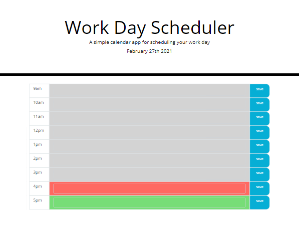
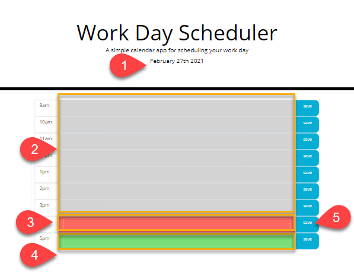
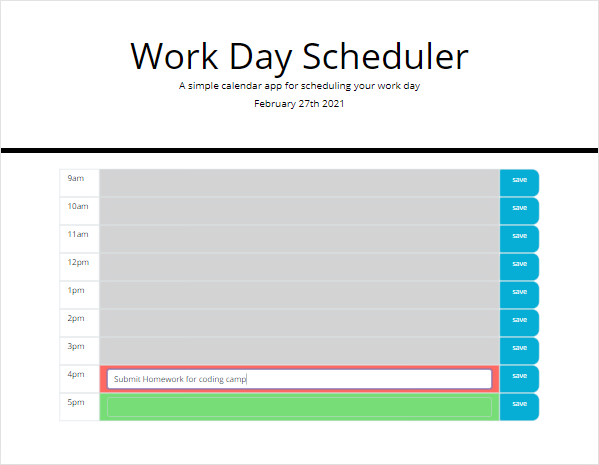
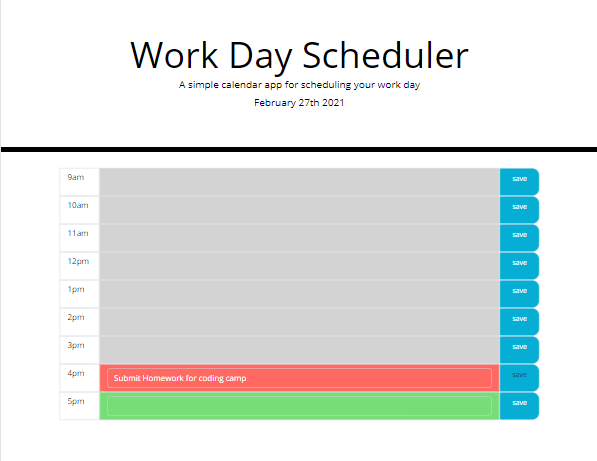

# 05-Third-Party-APIs-Calendar
Due Date: 2/27/2021 @ 11:59 PM
Coding Bootcamping assigned #5 - Third party APIs / Calendar

# Objectives
The primary objectives of this exercise were to demonstrate the following:

* use of third party API
* use of styling framework (Bootstrap)
* DOM manifulation
* DOM traversing
* dynamic HTML from Javascript
* local storage
* arrow functions (not in scope, but used)
* classes (not in scope, but used)

# References / Resources 

##### (best viewed in PREVIEW mode if you are presently inspecting raw markdown)

|Description|Link|
|-----------|----|
||Traversy Media / JavaScript Bootlist App|https://www.youtube.com/watch?v=JaMCxVWtW58|

# Screenshots
### Screen 1: **Initial Screen**

This is a simple calendar appointment entry exercise.

### Screen 2: **Different Features**

1. Using moment.js, wdisplay the current Date.
2. When the calendar is rendered, we need to colarize it.  Compare the current time to the time being renders.  This is the block of the calendar for time that is before the current hour.
3. This is the hour line stylized for the current hour
4. This is how the calendar is stylized for time in the future.
5. This is the save button.

### Screen 3: **Data Entry**

Here is a view of the screen during data entry.

### Screen 4: **Post Save**

This is a view once data has been inputted and saved.

## Links
* This repo is located [on github](https://github.com/jonesjsc/05-Third-Party-APIs-Calendar)
* This site is deployed on [github pages](https://jonesjsc.github.io/03-JavaScript-Password-Generator/)

## License
* 

## Fun Stats
* 
* 